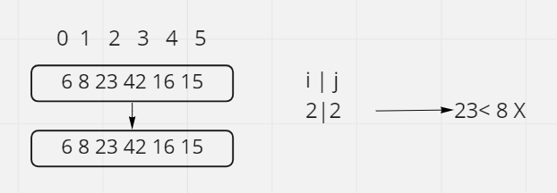
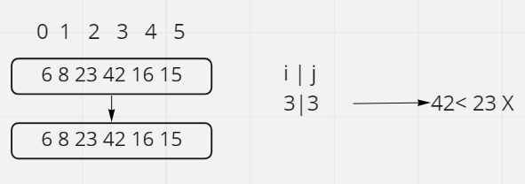
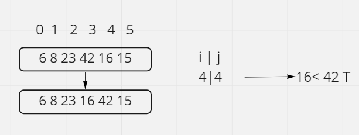
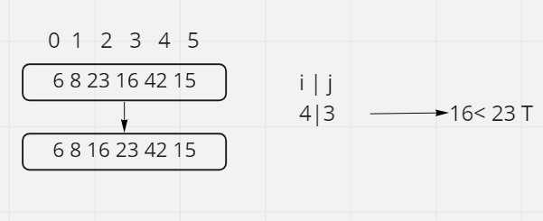
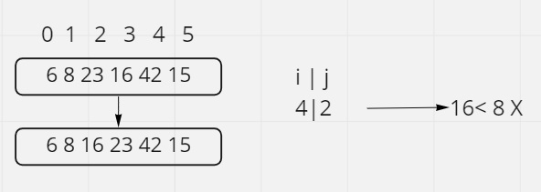
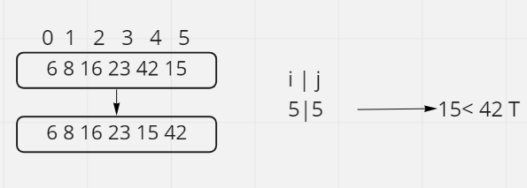
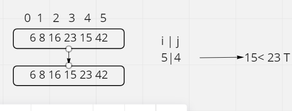
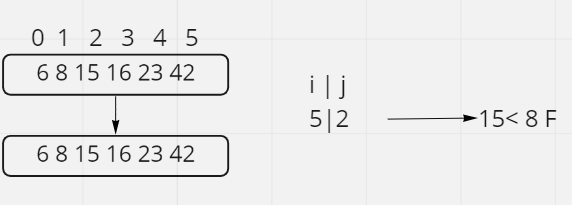

# Pseudocode
  InsertionSort(int[] arr)

    FOR i = 1 to arr.length

      int j <-- i - 1
      int temp <-- arr[i]

      WHILE j >= 0 AND temp < arr[j]
        arr[j + 1] <-- arr[j]
        j <-- j - 1

      arr[j + 1] <-- temp

# Trace

## In first we need to check if index 0 less than index 1

condition true we can swipe data

## second step index 2 with index 1
condition false we can not swipe data

## next step index  3 with index 2
condition false we can not swipe data

## next step index  4 with index 3
condition true we can swipe data

condition false we can not swipe data

## next step index 5 with 4
condition true we can swipe data

condition false we can not swipe data

## Efficency
Time: O(n^2) The basic operation of this algorithm is comparison. This will happen n * (n-1) number of times…concluding the algorithm to be n squared.

Space: O(1) No additional space is being created. This array is being sorted in place…keeping the space at constant O(1).
