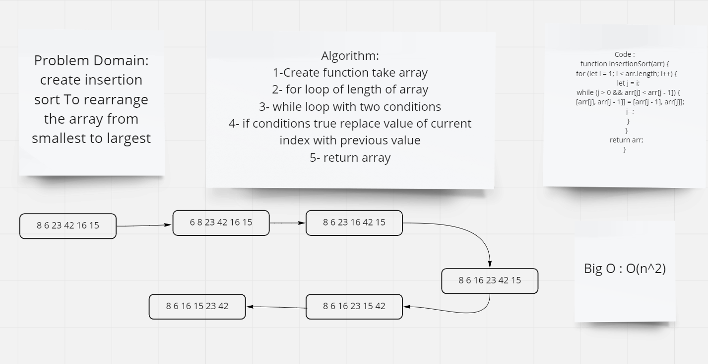

# Challenge Summary
create insertion sort To rearrange the array from smallest to largest

## Whiteboard Process

## Approach & Efficiency

### Approach
1. for loop to loop through the array
2. while loop to loop through the array with two conditions and swipe values from current value with privious value

### Efficiency

Big O : O(n^2) because we use two loop
