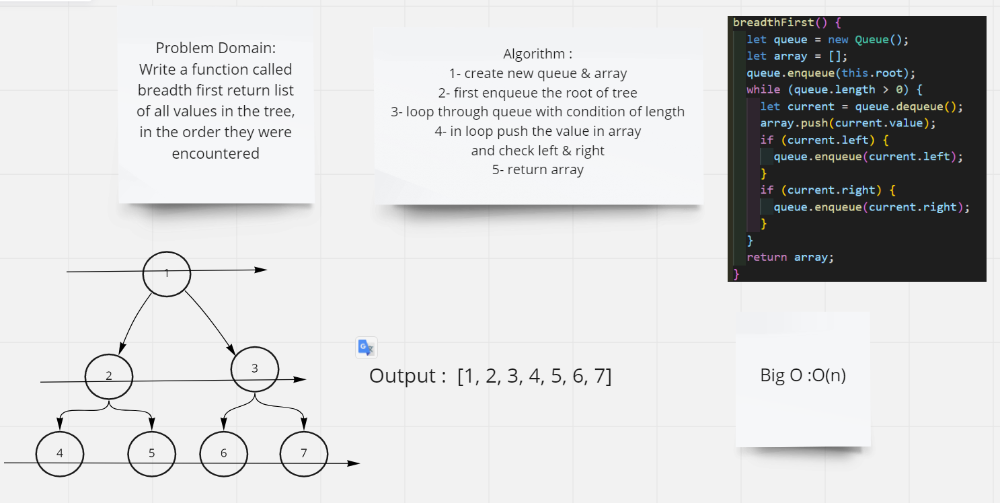

# Challenge Summary
Write a function called breadth first return list of all values in the tree, in the order they were encountered

## Whiteboard Process

## Approach & Efficiency

## Approach
- require Queue
- Queue methods
- while loop to loop through queue
- if statment to check conditions (left and right)

## Efficiency

Big O : O(n) because I use while loop
## Solution
npm test binary.test.js
