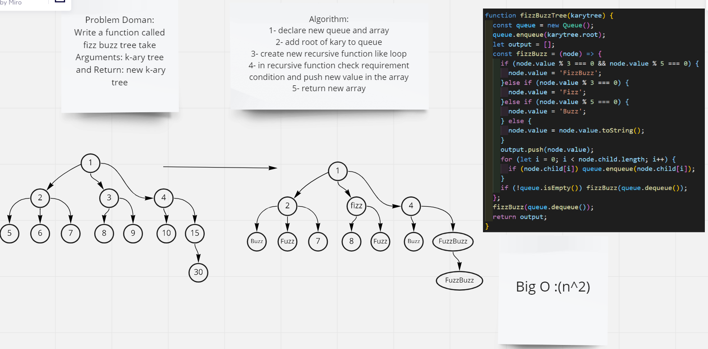

# Challenge Summary
Write a function called fizz buzz tree take
Arguments: k-ary tree and Return: new k-ary tree
## Whiteboard Process

## Approach & Efficiency

### Approach
1. queue and queue Methods
2. recursive function to loop and convert data to Fizz ,Buzz , FizzBuzz
3. if statment to check condition data convert to Fizz ,Buzz , FizzBuzz if need
4. for loop to add new child

### Efficiency
Big O : O(n^2) because we use recursive function

## Solution
npm test KAry.test.js
