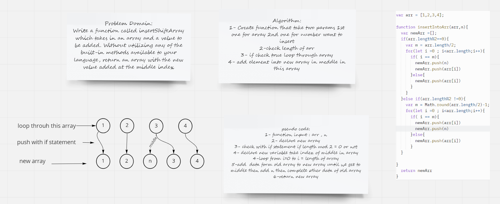

# Insert to Middle of an Array
Write a function called insertShiftArray which takes in an array and a value to be added. Without utilizing any of the built-in methods available to your language, return an array with the new value added at the middle index.

## Whiteboard Process

## Approach & Efficiency
I use :
- if statement to check the conditions
- for loop to pass data in array
- math.round to round number from decimal to integer
- push to add data to new array

