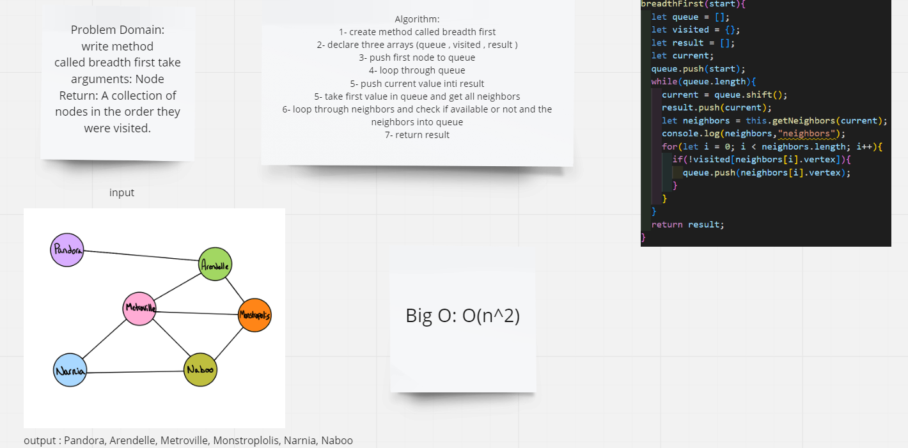

# Challenge Summary
write method called breadth first take arguments: Node
Return: A collection of nodes in the order they were visited.
## Whiteboard Process

## Approach & Efficiency
 time complexity : worst case of time complexity is O(n^2) because we use two loops

 space complexity : worst case of space complexity is O(n)
## Solution
npm run test graph.test
