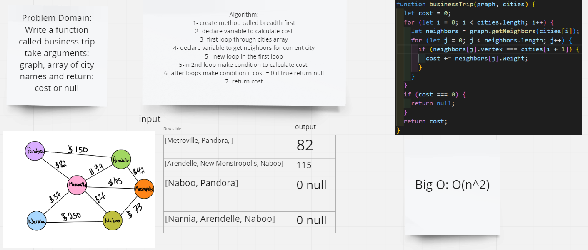

# Challenge Summary
Write a function called business trip take arguments: graph, array of city names and return: cost or null
## Whiteboard Process

## Approach & Efficiency
 time complexity : worst case of time complexity is O(n^2) because we use two loops

 space complexity : worst case of space complexity is O(1)
## Solution
npm run test trip.test
