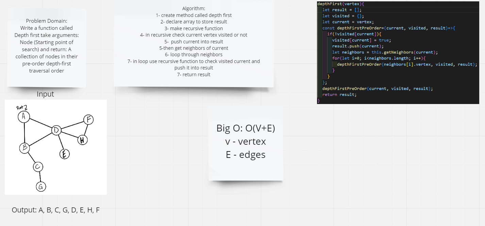

# Depth First Traversal
Depth-first search (DFS) is an algorithm for searching a graph or tree data structure. The algorithm starts at the root (top) node of a tree and goes as far as it can down a given branch (path), then backtracks until it finds an unexplored path, and then explores it.

## Challenge
Write a function called Depth first take arguments: Node (Starting point of search) and return: A collection of nodes in their pre-order depth-first traversal order

## Approach & Efficiency
In the case of a graph, the time complexity is O(V + E)
O(V+E) where V is the number of vertexes and E is the number of edges.

## Solution

