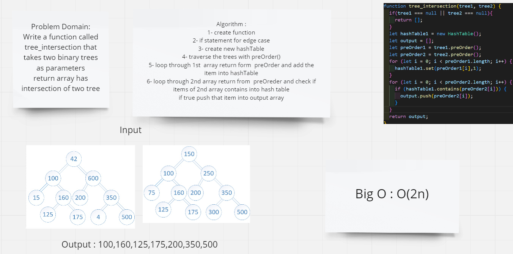

# Challenge Summary
Write a function called tree_intersection that takes two binary trees as parameters
return array has intersection of two tree
## Whiteboard Process

## Approach & Efficiency
### Approach
- if satament
- for loop over
- preOrder fron binaryTree
- set and contains from HashTable
### Efficiency
Big O is o(2n) because I use 2 for loop
## Solution
npm run test intersection.test
