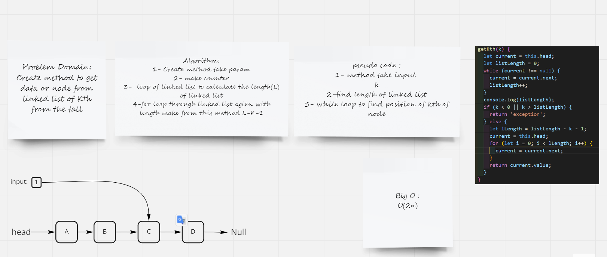

# Challenge Summary
Create method to get data or node from linked list of Kth from the tail

## Whiteboard Process

## Approach & Efficiency

### Approach

- while loop to calculate length of linked list
- if statment to check for exception
- for loop to find the position of kth node

### Efficiency

 Big O : O(2n) becuse I use two loops

## Solution

npm test linked-list-kth.test.js
