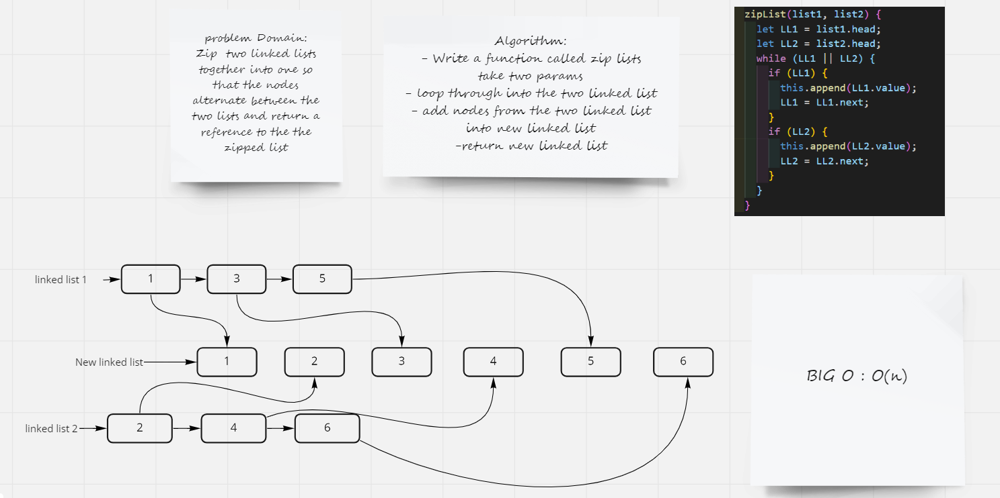

# Challenge Summary
Zip  two linked lists together into one so that the nodes alternate between the two lists and return a reference to the the zipped list

## Whiteboard Process

## Approach & Efficiency
### Approach

- while loop through two linked list
- if statment to check of correct linked list structure
- use append function to add nodes into new linked list
- toString for testing

### Efficiency

 Big O : O(n) becuse I use one loops

## Solution

npm test zip.test.js

