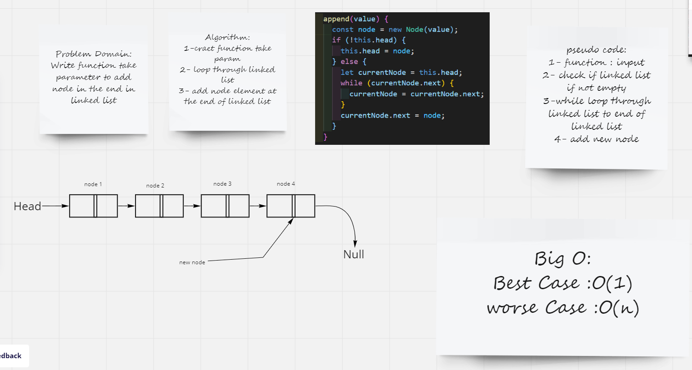
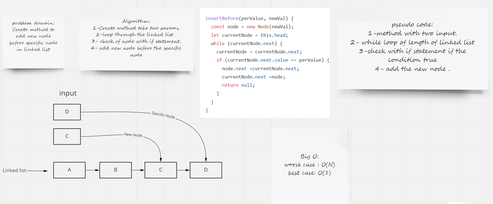
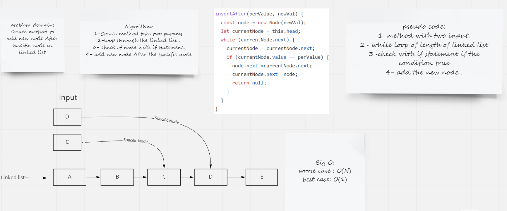

# Challenge Summary
Create Three function one for insert in the end of linked list second one insert before specific node third one insert after specific node.

## Whiteboard Process
### Append

### Insert Before

### Insert After

## Approach & Efficiency

### Approach

for three function use if statment to check the condition that we need and use while loop to loop through of linked list.

### Eficiency

for three function

  best case O(1) when loop and finish in 1st step of linked list.
  worse case O(n) when loop through all nodes in linked list

## Solution
 npm linked-list.test.js
