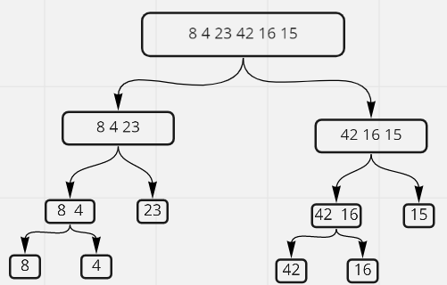
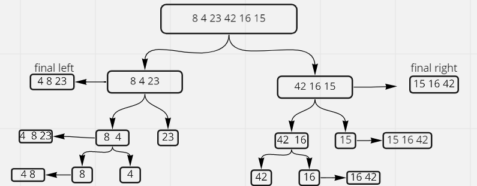
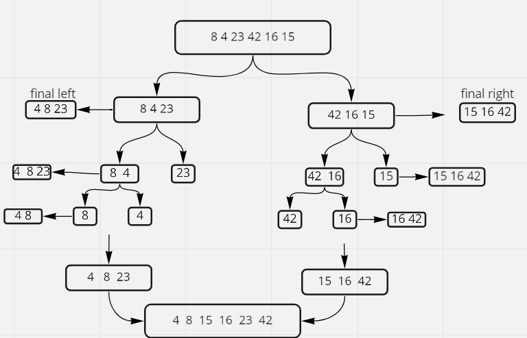

# Pseudocode
MergeSort

    ALGORITHM Mergesort(arr)
    DECLARE n <-- arr.length

    if n > 1
      DECLARE mid <-- n/2
      DECLARE left <-- arr[0...mid]
      DECLARE right <-- arr[mid...n]
      // sort the left side
      Mergesort(left)
      // sort the right side
      Mergesort(right)
      // merge the sorted left and right sides together
      Merge(left, right, arr)
    ALGORITHM Merge(left, right, arr)
    DECLARE i <-- 0
    DECLARE j <-- 0
    DECLARE k <-- 0
    while i < left.length && j < right.length
        if left[i] <= right[j]
            arr[k] <-- left[i]
            i <-- i + 1
        else
            arr[k] <-- right[j]
            j <-- j + 1

        k <-- k + 1

    if i = left.length
       set remaining entries in arr to remaining values in right
    else
       set remaining entries in arr to remaining values in left

# Trace
Sample Array: [8,4,23,42,16,15]

### Pass1

in first take sample array into mergeSort() function
first part in mergeSort split array to lift and right then either lift and right we split lift and right even size of lift and equal one like this picture :

### Pass2

in second part of mergeSort() declare new array and loop through lift and rights and check if lift[0] < right[0] if lift[0] less than right[0] push it to new array and remove first element in lift and the same thing for right if condition false

### Pass3

in last step check the privious conditon for final lift and final right return sorted array.

# Efficency
Time: O(n^2) The basic operation of this algorithm is comparison. This will happen n * (n-1) number of times…concluding the algorithm to be n squared.

Space: O(1) No additional space is being created. This array is being sorted in place…keeping the space at constant O(1).
