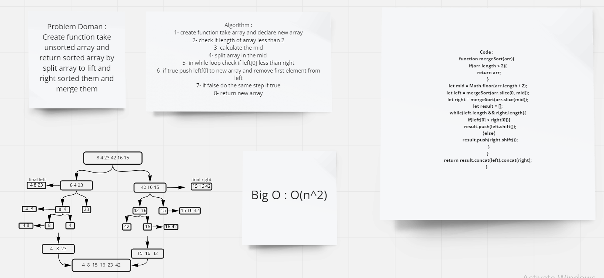

# Challenge Summary
Create function take unsorted array and return sorted array by split array to lift and right sorted them and merge them

## Whiteboard Process

## Approach & Efficiency

### Approach
I use if statment to check conditions
and while loop to loop through lift and right array of

### Efficiency
Big O : O(n^2) because we use recursion and while loop

## Solution
npm run start merge.test.js
