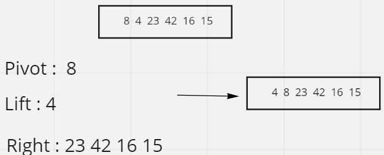
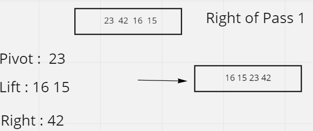
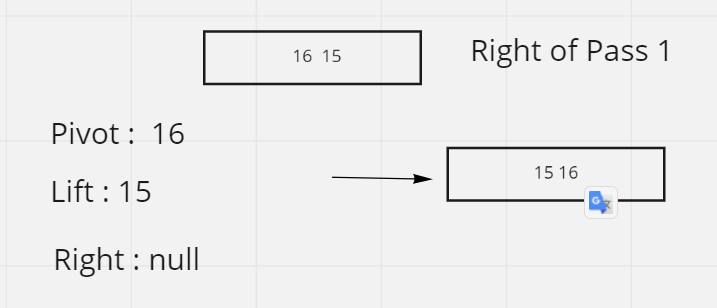
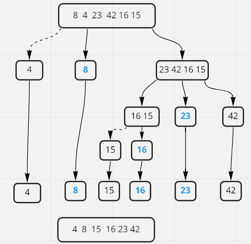

# Quick Sort
Selection Sort is a sorting algorithm that traverses the array multiple times as it slowly builds out the sorting sequence. The traversal keeps track of the minimum value and places it in the front of the array which should be incrementally sorted.

## Pseudo Code
    ALGORITHM QuickSort(arr, left, right)
          if left < right
              // Partition the array by setting the position of the pivot value
              DEFINE position <-- Partition(arr, left, right)
              // Sort the left
              QuickSort(arr, left, position - 1)
              // Sort the right
              QuickSort(arr, position + 1, right)

      ALGORITHM Partition(arr, left, right)
          // set a pivot value as a point of reference
          DEFINE pivot <-- arr[right]
          // create a variable to track the largest index of numbers lower than the defined pivot
          DEFINE low <-- left - 1
          for i <- left to right do
              if arr[i] <= pivot
                  low++
                  Swap(arr, i, low)

          // place the value of the pivot location in the middle.
          // all numbers smaller than the pivot are on the left, larger on the right.
          Swap(arr, right, low + 1)
          // return the pivot index point
          return low + 1

      ALGORITHM Swap(arr, i, low)
          DEFINE temp;
          temp <-- arr[i]
          arr[i] <-- arr[low]
          arr[low] <-- temp

## Trace

### Pass 1:

first check if the entered array length is less or equal 1 return array then determine the pivot arr[0] the check if another value in array less or larger than pivot if less push value into left array else push value into right array then return pass recursive left , pivot and recursive right.

### pass 2:

for left array the length is equal 1 retrn same array

for right array apply same steps in **Pass1**

### Pass 3:

for new left and right arrays :

right array the length is equal 1 retrn same array

but left array is larger than 1 then we need apply steps in **Pass1**

### Pass 4:
the new left and right arrays lenght is less and equal 1 then the same arrays

in the end return first left after sorted and first pivot and left array sfter sorted

# Efficency
Time: O(nlogn)

The average case run time of quick sort is O(n logn) In the worst case, it makes O(n^2) comparisons.

Space: The space complexity of Quick sort is O(log n). This algorithm takes a lot of space.
