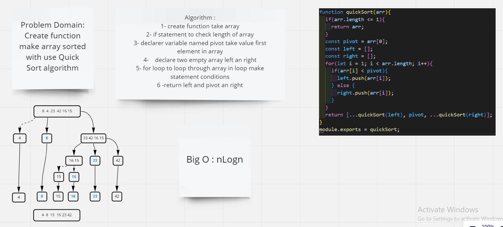

# Challenge Summary
Create function make array sorted with use Quick Sort algorithm
## Whiteboard Process

## Approach & Efficiency
### Approach
if statment to check conditions
for loop to loop through the array

### Efficiency
 Big O : nlogn because I use loop and Two recursive
## Solution
npm run test quick.test
