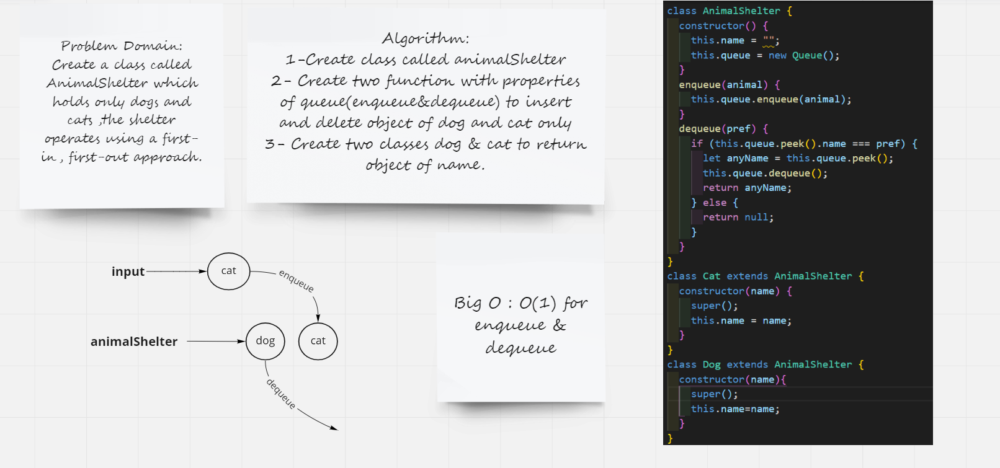

# Challenge Summary
Create a class called AnimalShelter which holds only dogs and cats ,the shelter operates using a first-in, first-out approach

## Whiteboard Process

## Approach & Efficiency

### Approach
I have used queue functions in new functions

### Efficiency

Big O : O(1) of two functions becuse I did not use loop just Linear Time Notation

## Solution
npm test animal.test.js
