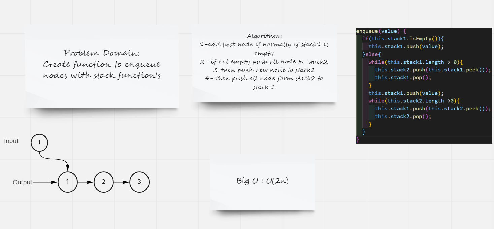
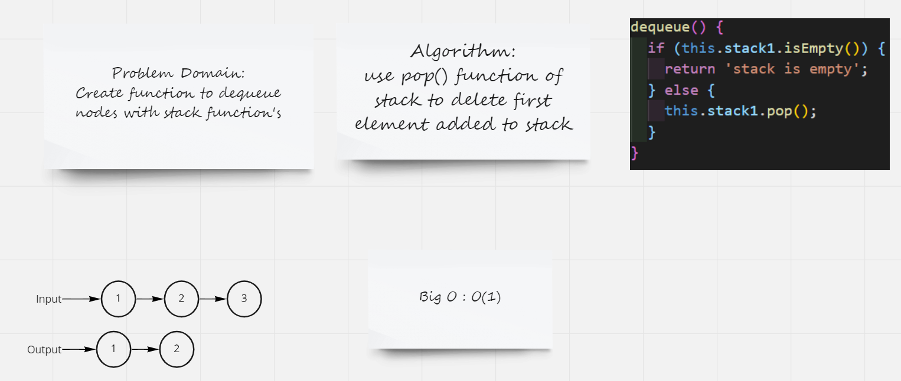

# Challenge Summary
Code challenge ask to Implement a Queue using two Stacks and using stack function's to create queue function
## Whiteboard Process

## Approach & Efficiency

### Approach
if statment to check if stack is empty;

while loopto move all data

## Efficiency

### enqueue
 Big O : O(2n) becuse use two while loop

 ### dequeue

 Big O : O(1)
## Solution
npm test queuepes.test.js
