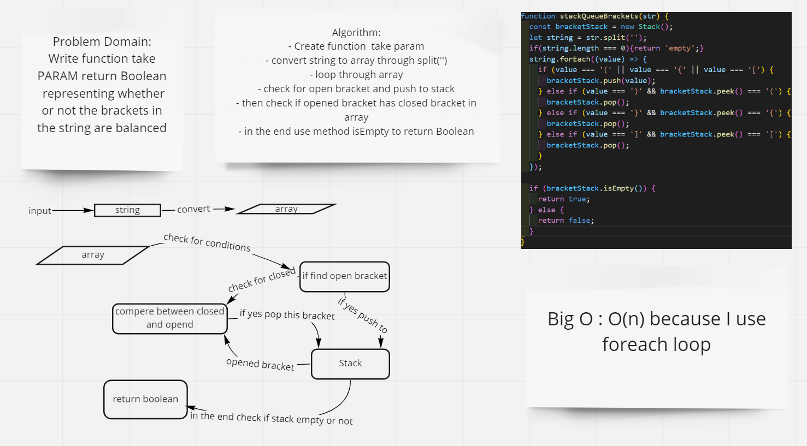

# Challenge Summary
Write function take PARAM return Boolean  representing whether or not the brackets in the string are balanced
## Whiteboard Process

## Approach & Efficiency

### Approach

- use split('') to convert a string to array
- forEach to loop through the array
- if statment to check conditions
- push & pop & isEmpty methods from stack

### Efficiency

Big O : O(n) because I use foreach loop

## Solution
npm test brackets.test.js
